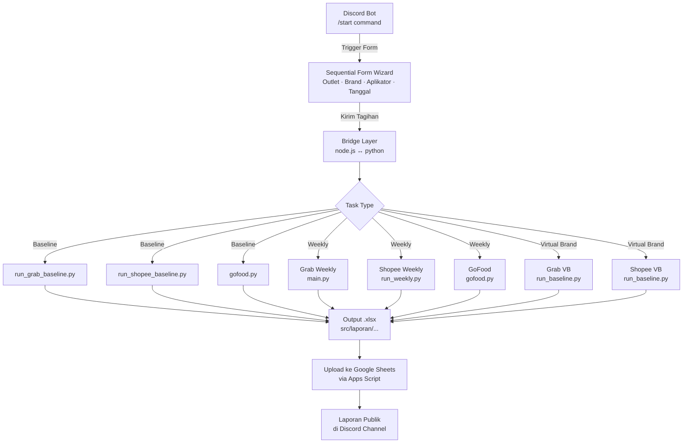

# 📊 OFD Report — Automation Pipeline V1

[](https://www.python.org/)
[](https://nodejs.org/)
[](https://github.com/astral-sh/uv)
[](https://docs.docker.com/compose/)
[](https://discord.js.org/)
[](https://www.postgresql.org/)

Sistem otomatisasi terpadu untuk pengambilan, pemrosesan, dan pelaporan data transaksi OFD (Online Food Delivery) dari platform **GrabFood**, **ShopeeFood**, dan **GoFood**. Proyek ini terdiri dari dua komponen utama: **Python Pipeline CLI** untuk scraping & konversi data, dan **Discord Bot** sebagai antarmuka pelaporan berbasis form interaktif.

---

## 🗺️ Arsitektur Sistem

```
automation-report-V1/
│
├── 📁 src/                         # Python Pipeline (Core Engine)
│   ├── cli.py                      # Titik masuk CLI utama (interaktif & argumen)
│   ├── pyproject.toml              # Konfigurasi proyek & dependensi Python (uv)
│   │
│   ├── 📁 grab-reportperformance/  # Scraper laporan performa GrabFood (Weekly)
│   ├── 📁 baseline/                # Pipeline Baseline: Grab & Shopee
│   │   ├── grab/                   # Scraper Baseline GrabFood
│   │   └── shopee/                 # Scraper Baseline ShopeeFood
│   ├── 📁 VB/ (Virtual Brand)      # Pipeline Virtual Brand: Grab & Shopee
│   │   ├── grab/
│   │   └── shopee/
│   ├── 📁 goscrapperv2/            # Scraper GoFood (Login & Dashboard)
│   ├── 📁 shopee-omzet-automation/ # Scraper Omzet ShopeeFood (Weekly)
│   ├── 📁 appscriptOFD/            # Google Apps Script untuk upload ke Sheets
│   ├── 📁 database/                # Skema & migrasi PostgreSQL (SRS DB)
│   ├── 📁 laporan/                 # Output laporan Excel hasil pipeline
│   ├── 📁 logs/                    # Log eksekusi pipeline
│   └── 📁 scripts/
│       └── setup_server.sh         # Script setup otomatis untuk server Linux
│
├── 📁 discord-bot-form/            # Discord Bot (Interface Pelaporan)
│   ├── index.js                    # Entry point bot
│   ├── deploy-commands.js          # Registrasi slash commands ke Discord
│   ├── package.json
│   └── 📁 src/commands/
│       └── 📁 Modals/
│           └── modal.js            # Logika form wizard & date picker
│
├── 📁 docs/                        # Dokumentasi teknis
│   ├── database_erd.md             # ERD & penjelasan arsitektur database
│   └── mitigation_proposal_local_trigger.md
│
├── Dockerfile                      # Image Docker untuk deployment server
├── docker-compose.yml              # Orkestrasi container (Bot + PostgreSQL)
├── start.sh                        # Launcher Linux untuk mode lokal
└── start.bat                       # Launcher Windows untuk mode lokal
```

---

## ✨ Fitur Utama

### 🐍 Python CLI Pipeline (`src/cli.py`)
| Mode | Deskripsi |
|---|---|
| **Baseline** | Menarik seluruh data historis outlet dari GrabFood, ShopeeFood, dan GoFood sekaligus |
| **Weekly** | Menarik laporan transaksi mingguan per platform |
| **Virtual Brand (VB)** | Khusus untuk akun Virtual Brand Grab & Shopee |

Fitur pendukung:
- 🗕 **Filter Outlet & Cabang** — Pilih outlet/cabang spesifik atau jalankan untuk semua
- 🔍 **Lookup Merchant Otomatis** — Resolusi nama merchant Shopee dari Google Sheets secara real-time
- 📅 **Format Tanggal Fleksibel** — Menerima `DD-MM-YYYY` maupun `YYYY-MM-DD`
- 🔄 **Auto-restart Loop** — CLI berjalan dalam loop sehingga bisa langsung dieksekusi ulang
- 💾 **Cache Google Sheets** — Mengurangi request redundan dengan caching CSV 24 jam

### 🤖 Discord Bot Form (`discord-bot-form/`)
- **Sequential Form Wizard** — Pengisian form step-by-step langsung di Discord (5 langkah)
- **Dynamic Cascading Filter** — Dropdown Brand difilter otomatis sesuai Outlet yang dipilih
- **Custom Date Picker** — Pemilih tanggal interaktif dengan paginasi (Hari 1–20 / 21–31)
- **Ephemeral Interaction** — Seluruh proses pengisian bersifat privat, hanya terlihat oleh pengisi
- **Public Final Summary** — Ringkasan tagihan diterbitkan secara publik setelah selesai diisi
- **Auto-cap 25 Items** — Mencegah error Discord API akibat limitasi 25 opsi per dropdown

### 🗄️ Database PostgreSQL (SRS — Superfood Reporting System)
Skema **Data Warehouse** dengan pendekatan Staging → Fact:
- `dim_merchants` — Master data outlet (Single Source of Truth)
- `stg_grab_orders` — Staging data mentah GrabFood
- `stg_shopee_orders` — Staging data mentah ShopeeFood
- `fact_transactions` — Tabel fakta terpadu (GrabFood + ShopeeFood)

> Lihat [docs/database_erd.md](docs/database_erd.md) untuk diagram ERD lengkap.

---

## 🛠️ Prasyarat

| Kebutuhan | Versi Minimal | Keterangan |
|---|---|---|
| Python | 3.12 | Untuk pipeline scraping |
| Node.js | 16.11.0 | Untuk Discord Bot |
| `uv` | terbaru | Package manager Python |
| Docker & Docker Compose | V2 | Untuk deployment server |
| Google Chrome | terbaru | Untuk headless scraping |

---

## 🚀 Menjalankan Secara Lokal

### Metode 1: Menggunakan Launcher Script (Direkomendasikan)

**Linux / macOS:**
```bash
chmod +x start.sh
./start.sh
```

**Windows:**
```bat
start.bat
```

Script launcher secara otomatis akan:
1. ✅ Mendeteksi atau menginstal `uv`
2. ✅ Menjalankan `uv sync` untuk instalasi dependensi Python
3. ✅ Mengunduh browser Chromium untuk Playwright (hanya sekali)
4. ✅ Menjalankan CLI interaktif dalam mode **headful** (browser terlihat untuk OTP/CAPTCHA)

---

### Metode 2: Manual (Advanced)

#### A. Setup Python Environment
```bash
cd src/
uv sync
uv run python -m playwright install chromium
```

#### B. Jalankan CLI Interaktif
```bash
cd src/
uv run python cli.py
```

#### C. Jalankan dengan Argumen CLI (Non-Interaktif)
```bash
# Grab Weekly
uv run python cli.py grab --start 2026-05-05 --end 2026-05-11

# Shopee Weekly
uv run python cli.py shopee --start 2026-05-05 --end 2026-05-11

# Semua Platform
uv run python cli.py all --start 2026-05-05 --end 2026-05-11
```

---

## 🐳 Deployment ke Server (Docker)

### Langkah 1: Setup Server (Pertama Kali)
Jalankan script setup otomatis pada server Linux Anda:
```bash
chmod +x src/scripts/setup_server.sh
./src/scripts/setup_server.sh
```

Script ini akan menginstal: **Docker**, **uv**, dan **Google Chrome**.

> ⚠️ **Penting:** Setelah setup selesai, lakukan **logout** lalu **login ulang** ke SSH agar permission Docker aktif.

---

### Langkah 2: Konfigurasi Environment Variables

Buat file `.env` di dalam folder `discord-bot-form/`:
```bash
cp discord-bot-form/.env.example discord-bot-form/.env
nano discord-bot-form/.env
```

Isi variabel berikut:
```env
# Discord Bot
DISCORD_TOKEN=TOKEN_BOT_DISCORD_ANDA
CLIENT_ID=ID_APLIKASI_BOT
GUILD_ID=ID_SERVER_DISCORD

# Database (sudah dikonfigurasi di docker-compose.yml, sesuaikan jika perlu)
DB_HOST=db
DB_PORT=5432
DB_USER=superfood_admin
DB_PASS=superfood_password
DB_NAME=srs_db
```

---

### Langkah 3: Build & Jalankan Container

```bash
# Build image dan jalankan semua service
docker compose up -d --build

# Lihat log real-time
docker compose logs -f

# Cek status container
docker compose ps
```

---

### Langkah 4: Setup Discord Bot (Sekali)

Daftarkan slash commands ke server Discord yang ditentukan:
```bash
# Masuk ke container yang berjalan
docker exec -it ofd_discord_bot sh

# Daftarkan commands
node deploy-commands.js
```

---

### Manajemen Container

```bash
# Hentikan semua service
docker compose down

# Restart service tertentu
docker compose restart bot

# Lihat log service tertentu
docker compose logs -f bot
docker compose logs -f db
```

---

## 📂 Output Laporan

Semua laporan Excel hasil pipeline disimpan di:
```
src/laporan/
├── grab/           # Laporan Weekly GrabFood
├── grab_baseline/  # Laporan Baseline GrabFood
├── grab_vb/        # Laporan VB GrabFood
├── shopee/         # Laporan Weekly ShopeeFood
├── shopee_baseline/# Laporan Baseline ShopeeFood
├── shopee_vb/      # Laporan VB ShopeeFood
└── gofood/         # Laporan GoFood
```

Setiap sub-folder diberi nama dengan format: `{start_date}_to_{end_date}/`.

---

## 🔄 Alur Pipeline Lengkap



---

## 📚 Dokumentasi Tambahan

| Dokumen | Deskripsi |
|---|---|
| [docs/database_erd.md](docs/database_erd.md) | ERD database PostgreSQL & penjelasan alur ETL |
| [docs/mitigation_proposal_local_trigger.md](docs/mitigation_proposal_local_trigger.md) | Proposal mitigasi concurrency & local trigger |
| [discord-bot-form/README.md](discord-bot-form/README.md) | Dokumentasi lengkap Discord Bot Form Wizard v2 |

---

## 📦 Dependensi Utama

### Python (`src/pyproject.toml`)
| Package | Kegunaan |
|---|---|
| `playwright` | Scraping headless browser (Chromium) |
| `selenium` + `undetected-chromedriver` | Scraping browser alternatif |
| `pandas` | Manipulasi dan transformasi data |
| `openpyxl` | Baca/tulis file Excel |
| `requests` | HTTP requests ke Google Sheets API |
| `python-dotenv` | Manajemen environment variables |
| `rich` | Output terminal yang lebih informatif |
| `filelock` | Mencegah race condition pada akses file |

### Node.js (`discord-bot-form/package.json`)
| Package | Kegunaan |
|---|---|
| `discord.js v14` | Framework Discord Bot |

---

## ⚠️ Catatan Penting

- **Mode Lokal vs Server**: `start.sh` secara otomatis menjalankan browser dalam mode **headful** (`HEADLESS=false`) agar staff dapat menyelesaikan OTP/CAPTCHA secara manual. Di server, Docker menggunakan `HEADLESS=true`.
- **Session & Cookie**: Data sesi browser Playwright disimpan di `src/shopee-omzet-automation/data/` dan di-mount ke volume Docker agar tidak hilang saat container di-restart.
- **Database Port**: PostgreSQL di-expose ke port `5433` (host) → `5432` (container) untuk menghindari konflik dengan instalasi PostgreSQL lokal.
- **Concurrency**: Gunakan `filelock` yang sudah terintegrasi untuk mencegah konflik jika beberapa pipeline dijalankan bersamaan.

---

Dibuat dengan 💻 oleh **Team Radi & Antigravity** (Google DeepMind)
