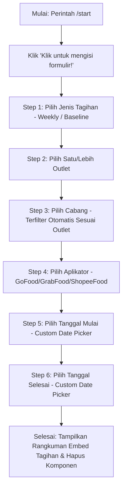

# 📊 Discord Bot Agency - Tagihan & Modal (v2: Sequential Form Wizard)

[](https://nodejs.org/)
[](https://discord.js.org/)
[](https://www.google.com/sheets/about/)

Selamat datang di **v2** dari Bot Discord Agency! Versi ini menghadirkan perombakan total pada arsitektur form input. Mengingat keterbatasan Discord Modal bawaan (seperti tidak fleksibel, batasan komponen, dan tidak mendukung pembaruan dinamis), versi 2 memperkenalkan **Sequential Chat-Based Form Wizard** yang sepenuhnya dinamis, interaktif, dan *ephemeral*.

---

## 🚀 Fitur Utama & Keunggulan v2

*   **Sequential Form Wizard (Step-by-Step)**: Alur pengisian form bergantian secara bertahap dari langkah 1 sampai 5 langsung di dalam chat secara interaktif.
*   **Dynamic Cascading Filter (Penyaringan Cabang)**:
    *   Pada **Langkah 2 (Pilih Outlet)**, pengguna dapat memilih satu atau beberapa outlet.
    *   Pada **Langkah 3 (Pilih Cabang)**, menu dropdown secara dinamis **hanya menampilkan cabang-cabang yang merupakan bagian dari outlet yang dipilih sebelumnya**, berdasarkan pemetaan data *real-time* dari Google Sheets!
*   **Custom Paginated Date Picker**:
    *   Sistem pemilihan tanggal interaktif yang dibangun menggunakan komponen asli Discord (*String Select Menus* dan *Buttons*).
    *   Mendukung pemilihan Bulan, Tahun, dan Hari secara instan.
    *   **Fitur Paginasasi Hari**: Membagi tanggal menjadi dua halaman (Hari 1-20 dan Hari 21-31) menggunakan tombol navigasi (⬅️/➡️) untuk mematuhi limitasi maksimal 25 pilihan pada menu Discord.
    *   Tombol konfirmasi dinamis yang akan berubah menjadi warna hijau (*Success*) ketika tanggal selesai dipilih dan siap dikonfirmasi.
*   **Batas Aman API Discord (Auto Capping)**: Secara otomatis memotong daftar opsi menjadi maksimal 25 data teratas untuk mencegah kegagalan *Invalid Form Body* akibat limitasi API Discord.
*   **Penghapusan Komponen Otomatis**: Setelah pengisian selesai, semua tombol dan dropdown interaktif otomatis dihapus dari chat sehingga tampilan tetap rapi dan menghindari pengiriman ulang secara tidak sengaja.
*   **Keamanan & Privasi (Ephemeral)**: Seluruh langkah interaksi pengisian form bersifat *ephemeral* (hanya dapat dilihat oleh pengisi), sehingga tidak menyepam channel dengan pilihan dropdown Anda.
*   **Opsi "Pilih Semua" (Select All)**: Pilihan `🌟 Pilih Semua` tersedia untuk **Pilih Outlet**, **Pilih Cabang**, dan **Pilih Aplikator** untuk rekapitulasi data menyeluruh secara instan tanpa perlu memilih satu per satu.
*   **Visual Progress Tracker**: Menampilkan progress bar interaktif di atas Embed (`📝 Tagihan ➔ 🏢 Outlet ➔ 📍 Cabang ➔ 📱 Aplikator ➔ 📅 Tanggal`) agar pengguna tahu letak langkah pengisian saat ini.
*   **Rangkuman Final Publik (Public Final Summary)**: Setelah pengisian selesai, bot secara otomatis menerbitkan rekapitulasi hasil final secara **publik** ke channel agar dapat dilihat, direview, dan diakses oleh semua orang di server.

---

## 📐 Alur Pengisian Formulir (Sequential Flow)



---

## 📂 Struktur Folder Proyek

```text
discord v2/
├── src/
│   └── commands/
│       └── Modals/
│           └── modal.js        # Logika utama form flow, date picker, & parsing sheet
├── deploy-commands.js          # Script registrasi slash commands ke Discord API
├── index.js                    # Entri utama bot & pendelegasian interaksi ke handler
├── package.json                # Dependensi proyek & NPM scripts
├── .env                        # Variabel lingkungan rahasia (token & ID)
└── README.md                   # Dokumentasi v2 (File ini)
```

---

## 🛠️ Prasyarat & Persiapan

1.  **Node.js**: Versi **16.11.0** atau yang lebih baru.
2.  **Akun Discord Developer**: Untuk membuat aplikasi bot dan mendapatkan token.
3.  **Google Sheets**: Spreadsheet dengan data outlet/cabang yang sudah dipublikasikan ke web dalam format **CSV**.
    *   Memiliki kolom: `Nama Outlet`, `Status` (hanya baris berstatus `Live` yang akan dimuat), dan `Cabang`.

---

## 📦 Panduan Instalasi & Konfigurasi

### 1. Masuk ke Direktori Proyek
Pastikan terminal Anda berada di direktori `discord v2`:
```bash
cd "discord v2"
```

### 2. Instal Dependensi
Pasang pustaka Node.js yang diperlukan:
```bash
npm install
```

### 3. Konfigurasi File `.env`
Buat file bernama `.env` pada direktori root `discord v2`, lalu konfigurasikan dengan kredensial bot Anda:
```env
DISCORD_TOKEN=TOKEN_BOT_ANDA_DI_SINI
CLIENT_ID=ID_APLIKASI_BOT_ANDA
GUILD_ID=ID_SERVER_DISCORD_ANDA
```

---

## 🚀 Cara Menjalankan Bot

### Langkah 1: Daftarkan Slash Command
Daftarkan perintah slash `/start` secara instan ke server Discord yang ditentukan pada `GUILD_ID`:
```bash
node deploy-commands.js
```

### Langkah 2: Jalankan Bot
Jalankan bot menggunakan script start:
```bash
npm start
```
*Atau:*
```bash
node index.js
```

---

## ⚠️ Batas Waktu Pengisian & Keandalan Tingkat Tinggi

Untuk menjaga kenyamanan pengguna dan stabilitas memori bot:
*   **Waktu Batas Sangat Leluasa**: Setiap langkah pengisian (tipe, outlet, cabang, aplikator, dan tanggal) diberikan batas waktu yang longgar sebesar **300 detik (5 menit)** per langkah sebelum memicu pembatalan otomatis.
*   **Chaining Active Interactions**: Menggunakan sistem respons berantai atomik (`interaction.update`) yang memastikan status interaksi terus diperbarui secara instan. Ini menjamin sistem **100% bebas dari error API Discord** seperti `40060 (Interaction already acknowledged)` dan `10062 (Unknown interaction)`.

---

Dibuat dengan 💻 oleh Team Radi & Antigravity (Google Deepmind)
