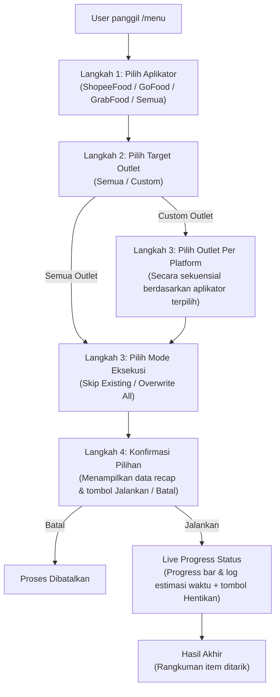

# Discord Bot Menu Pipeline 🚀

Repository bot Discord baru ini dirancang untuk memicu, memonitor, dan merekap hasil eksekusi **Menu & Modifier Extractor Pipeline** secara visual melalui Discord UI.

---

## 📋 Alur Interaksi (User Flow)

Bot ini menggunakan sistem interaktif berbasis *Dropdown Select Menu*, *Modal*, dan *Button* di Discord. Berikut adalah gambaran alur langkah demi langkah:

---

## 🛠️ Opsi Pilihan & Kunci Form (Interactive Steps)

### 1. Pilih Aplikator / Platform (Dropdown)
*   **ShopeeFood** (🟠)
*   **GoFood** (🔴)
*   **GrabFood** (🟢)
*   **Semua Aplikator** (🌟)

### 2. Pilih Target Outlet (Dropdown)
*   `🌟 Pilih Semua Outlet` — Memproses seluruh outlet terdaftar.
*   `⚙️ Pilih Custom Outlet` — Memilih secara spesifik outlet per platform.

### 3. Pemilihan Custom Outlet Sekuensial (Hanya jika memilih "Pilih Custom Outlet")
User akan diminta memilih outlet untuk masing-masing platform terpilih dengan kriteria filter sebagai berikut:
*   **GrabFood**: Menampilkan hanya outlet yang kolom `Nama Pengguna` tidak kosong/null/`-`.
*   **ShopeeFood**: Menampilkan hanya outlet yang kolom `Merchant Name` tidak kosong/null/`-`.
*   **GoFood**: Menampilkan hanya outlet yang kolom `Email Login Go 1` atau `Email Login Go 2` tidak kosong/null/`-`.

*Catatan: Jika memilih "Semua Aplikator" di awal, user akan diminta memilih 3 kali secara berurutan (Grab -> Shopee -> Go).*

### 4. Mode Eksekusi (Dropdown)
*   `Skip Existing` — Hanya mengunduh yang datanya kosong/belum ada.
*   `Overwrite All` — Mengunduh ulang menu dan menimpa file lama.

---

## 🔄 Jembatan Eksekusi (Bridge: Node.js to Python)

Bot menggunakan `child_process.spawn` untuk memanggil script Python di server dengan menyuplai variabel lingkungan:

*   `MENU_DISCORD_MODE`: `"1"`
*   `MENU_APLIKATOR`: Pilihan aplikator (`shopee`, `gofood`, `grab`, atau `all`).
*   `MENU_STORE_CHOICE`: Pilihan target (`all`, atau daftar koma-separated Store ID yang dipilih).
*   `MENU_OVERWRITE`: `"1"` untuk overwrite, `"0"` untuk skip existing.
