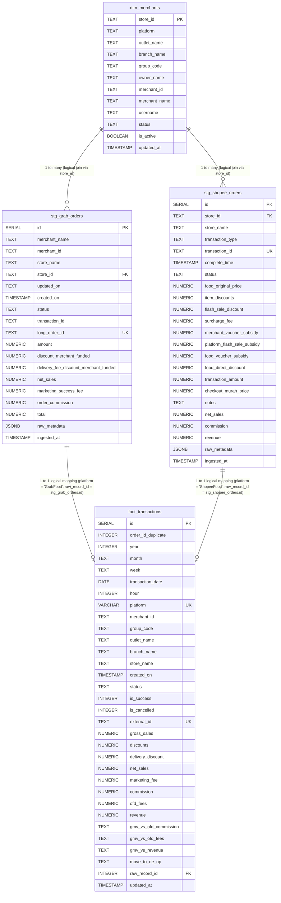

# Superfood Reporting System (SRS) Database ERD

Berikut adalah Entity-Relationship Diagram (ERD) dan penjelasan struktur database PostgreSQL yang digunakan dalam repositori ini untuk mengolah data transaksi dari platform kuliner (GrabFood dan ShopeeFood).

---

## 1. Entity-Relationship Diagram (Mermaid)

---

## 2. Penjelasan Relasi & Arsitektur Tabel

Database ini dirancang menggunakan pendekatan **Staging & DWH (Data Warehouse)** sederhana dengan model *Star/Snowflake Schema*:

### A. Tabel Dimensi (Dimension Table)
*   **`dim_merchants`**: Menyimpan data master outlet/toko.
    *   **Primary Key**: `store_id` (unik untuk setiap outlet di masing-masing platform).
    *   Berperan sebagai *Single Source of Truth* untuk informasi administratif toko seperti `group_code`, `owner_name`, `branch_name`, dan status operasional (`is_active`).

### B. Tabel Staging (Raw Data Lake)
Tabel staging digunakan untuk menampung data mentah hasil *scraping* atau *API ingestion* dari masing-masing platform sebelum dinormalisasi ke tabel fakta.
*   **`stg_grab_orders`**: Menampung data transaksi mentah dari GrabFood. Relasi logis ke tabel master adalah melalui `store_id`.
*   **`stg_shopee_orders`**: Menampung data transaksi mentah dari ShopeeFood. Relasi logis ke tabel master adalah melalui `store_id`.

### C. Tabel Fakta (Fact Table / Tabel Gajah)
*   **`fact_transactions`**: Merupakan tabel terpadu (*unified*) yang menyatukan data transaksi dari GrabFood dan ShopeeFood ke dalam satu format standar agar mudah dianalisis.
    *   **Unique Constraint**: `(platform, external_id)` memastikan tidak ada data duplikat untuk transaksi yang sama.
    *   **`raw_record_id`**: Berfungsi sebagai foreign key logis ke tabel staging asal (`stg_grab_orders.id` jika `platform = 'GrabFood'` atau `stg_shopee_orders.id` jika `platform = 'ShopeeFood'`).
    *   **`external_id`**: Berisi ID unik transaksi eksternal dari platform (`long_order_id` untuk Grab atau `transaction_id` untuk Shopee).

---

## 3. Alur Sinkronisasi Data (Pipeline ETL)

1.  **Sync Merchants (`sync_merchants.py`)**:
    *   Mengambil data master dari Google Sheets.
    *   Melakukan upsert ke `dim_merchants` berdasarkan `store_id`.
    *   Hanya menyimpan data yang memiliki status aktif (`is_active = TRUE`).
2.  **Ingestion (`db_manager.py`)**:
    *   Data Grab/Shopee hasil scraping dimasukkan ke dalam `stg_grab_orders` / `stg_shopee_orders`.
3.  **Normalization (`functions.sql` -> `refresh_fact_transactions()`)**:
    *   Trigger atau fungsi database membaca data dari tabel staging, melakukan `LEFT JOIN` ke `dim_merchants` berdasarkan `store_id` untuk melengkapi data outlet (`group_code`, `outlet_name`, `branch_name`), lalu menyisipkan/mengupdate data ke dalam `fact_transactions`.
    *   Melakukan kalkulasi metrik finansial terstandarisasi seperti `net_sales` (GMV), `ofd_fees`, dan `revenue` (payout bersih).
