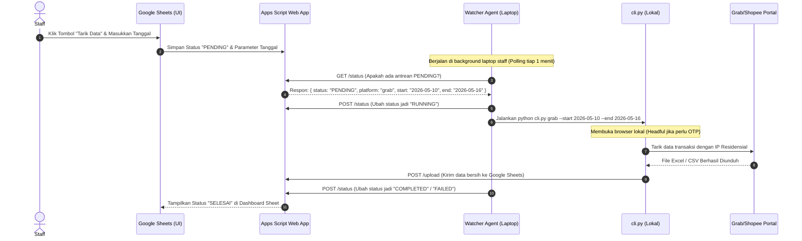
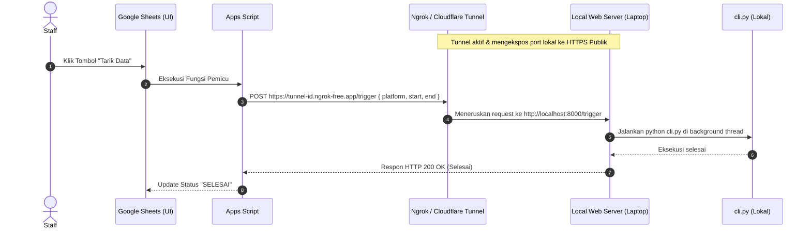

# Usulan Mitigasi: Arsitektur Pemicu Lokal (Local Trigger) dari Google Sheets untuk Scraping Grab & Shopee

Dokumen ini berisi tinjauan mendalam, analisis teknis, dan rancangan arsitektur untuk usulan Anda: **menjalankan sistem penarikan data secara lokal di laptop staff menggunakan IP residensial (untuk menghindari blokir IP server/datacenter) yang ditrigger langsung melalui tombol di Google Sheets.**

---

## 1. Analisis Latar Belakang & Masalah (Problem Statement)

Saat menjalankan otomasi web scraping (seperti Grab Merchant Portal dan Shopee Omzet) di server cloud (AWS, GCP, DigitalOcean, dll.), kita sering menghadapi kendala besar:
1. **IP Datacenter Diblokir (Geoblocking & Anti-Bot):** Platform besar menggunakan Cloudflare, Akamai, atau AWS WAF yang secara agresif mendeteksi dan memblokir rentang IP datacenter.
2. **Kebutuhan Verifikasi Multi-Faktor (2FA/OTP/CAPTCHA):** Grab dan Shopee secara berkala meminta kode OTP via SMS/email atau tantangan CAPTCHA yang sangat sulit diselesaikan dalam lingkungan server *headless* (tanpa monitor).
3. **Fleksibilitas IP Residensial:** Laptop staff menggunakan IP koneksi internet rumah/kantor (residensial) yang dianggap "aman" dan memiliki reputasi tinggi oleh sistem proteksi bot. Selain itu, jika muncul OTP/CAPTCHA, staff bisa langsung menyelesaikannya secara manual karena browser berjalan dalam mode *headful* (terlihat).

> [!IMPORTANT]
> **Tantangan Utama Sistem Pemicu (Trigger):**
> Google Sheets berjalan sepenuhnya di cloud Google. Script di Google Sheets (**Apps Script**) tidak bisa langsung menembak/mengirim perintah HTTP ke laptop staff karena laptop berada di belakang **NAT (Network Address Translation)** dan firewall router tanpa IP publik statis.

---

## 2. Pilihan Arsitektur Mitigasi

Berikut adalah 3 arsitektur alternatif untuk mewujudkan usulan Anda, lengkap dengan alur kerja, kelebihan, dan kekurangannya.

### Arsitektur A: Polling Agent / Watcher Daemon (Sangat Direkomendasikan ⭐)
Dalam model ini, Google Sheets tidak "menembak" laptop, melainkan laptop yang secara berkala "bertanya" (melakukan *polling*) ke Google Sheets apakah ada antrean tugas baru.



* **Kelebihan:**
  * **Sangat Aman:** Tidak perlu membuka port di router laptop, tidak perlu IP publik statis, dan bebas dari risiko keamanan luar.
  * **Mudah Diinstal:** Staff hanya perlu menjalankan satu script python ringan di laptop mereka (bisa dibungkus jadi file `.bat` atau `.sh` yang tinggal diklik dua kali).
  * **Reliabel:** Tidak tergantung pada kestabilan koneksi tunnel pihak ketiga (seperti ngrok).
* **Kekurangan:** Ada jeda waktu (delay) sekitar 1–2 menit tergantung interval polling yang kita set.

---

### Arsitektur B: Webhook Tunnel (Ngrok / Cloudflare Tunnel)
Google Sheets langsung mengirimkan HTTP POST request ke laptop staff secara real-time melalui jalur tunnel terenkripsi yang disediakan oleh pihak ketiga.



* **Kelebihan:** Real-time (instan), tidak ada delay polling.
* **Kekurangan:**
  * **Instalasi Rumit:** Staff harus menginstal Ngrok/Cloudflare Tunnel di laptop masing-masing.
  * **Biaya/Konfigurasi:** Akun gratis ngrok memiliki subdomain yang berubah-ubah setiap kali dijalankan kembali, kecuali jika dikonfigurasi dengan domain statis berbayar.
  * **Potensi Security:** Membuka akses masuk (inbound) dari internet ke laptop lokal selalu memiliki celah keamanan jika tidak diamankan dengan token autentikasi yang ketat.

---

### Arsitektur C: Aplikasi Launcher Lokal (Desktop UI)
Alih-alih menaruh tombol di Google Sheets, kita menyediakan aplikasi desktop sederhana (GUI sederhana menggunakan Python `tkinter`/`customtkinter` atau web app lokal) yang diinstal di laptop staff.

* **Alur Kerja:**
  1. Staff membuka aplikasi **Superfood Scraper Launcher** di laptop mereka.
  2. Aplikasi tersebut membaca rentang tanggal secara otomatis (default: 7 hari terakhir) atau membiarkan staff memilih tanggal.
  3. Staff mengeklik tombol **"Mulai Scraping"** di aplikasi desktop tersebut.
  4. Aplikasi langsung mengeksekusi `cli.py` secara lokal, membuka browser, menarik data, dan otomatis mengunggah hasilnya ke Google Sheets pusat menggunakan file `upload_master.py` yang sudah ada.
* **Kelebihan:**
  * Paling mudah dibuat dan dipelihara.
  * Feedback UI sangat jelas (ada log langsung yang tampil di jendela aplikasi).
  * Penanganan OTP/CAPTCHA paling alami karena berjalan langsung di depan mata user.
* **Kekurangan:** Tombol pemicu tidak berada langsung di dalam Google Sheets (pindah ke aplikasi lokal).

---

## 3. Matriks Perbandingan Solusi

| Parameter | Arsitektur A: Polling Agent | Arsitektur B: Webhook Tunnel | Arsitektur C: Desktop Launcher |
| :--- | :--- | :--- | :--- |
| **Kemudahan bagi Staff** | ⭐⭐⭐⭐ (Tinggal klik 1 script run) | ⭐½ (Perlu setting tunnel & server) | ⭐⭐⭐⭐⭐ (Aplikasi klik-and-run) |
| **Trigger dari GSheet** | Ya (via Status Sheet) | Ya (Langsung/Instant) | Tidak (Trigger dari UI Aplikasi) |
| **Keamanan Jaringan** | Sangat Aman (Outbound saja) | Cukup (Perlu token autentikasi) | Sangat Aman (Outbound saja) |
| **Penanganan OTP/CAPTCHA**| Sangat Baik (Membuka browser lokal) | Sangat Baik (Membuka browser lokal) | Sangat Baik (Membuka browser lokal) |
| **Kompleksitas Kode** | Rendah (Hanya loop polling ringan) | Sedang (Perlu web server lokal) | Rendah (Hanya GUI pembungkus CLI) |

---

## 4. Usulan Cetak Biru (Blueprint) Implementasi Arsitektur A
Jika Anda ingin mempertahankan tombol di Google Sheets, **Arsitektur A (Polling Agent)** adalah solusi terbaik, teraman, dan paling mudah dipasang di laptop staff non-teknis. Berikut adalah rencana pembuatan sistemnya:

### 4.1. Pembuatan Sheet "Queue" di Google Sheets
Kita buat sheet baru bernama `System_Queue` dengan kolom berikut:

| Job ID | Timestamp | Platform | Start Date | End Date | Status | Operator | Message |
| :--- | :--- | :--- | :--- | :--- | :--- | :--- | :--- |
| JOB-001 | 2026-05-17 10:00 | grab | 2026-05-10 | 2026-05-16 | `PENDING` | Budi | Menunggu agen lokal... |

* Ketika tombol **"Tarik Data"** di Google Sheets diklik, Apps Script akan memasukkan baris baru dengan status `PENDING`.

### 4.2. Penambahan Script di Google Apps Script (`google_apps_script.gs`)
Kita perlu menambahkan endpoint `doGet` dan memperluas `doPost` di Google Apps Script Anda untuk melayani polling dari laptop lokal:

```javascript
// Memproses polling dari laptop lokal (GET)
function doGet(e) {
  var action = e.parameter.action;
  var ss = SpreadsheetApp.getActiveSpreadsheet();
  var queueSheet = ss.getSheetByName("System_Queue");
  
  if (!queueSheet) {
    return ContentService.createTextOutput(JSON.stringify({ status: "error", message: "Queue sheet not found" }))
      .setMimeType(ContentService.MimeType.JSON);
  }
  
  if (action === "poll") {
    // Cari pekerjaan berstatus "PENDING" tertua
    var data = queueSheet.getDataRange().getValues();
    for (var i = 1; i < data.length; i++) {
      if (data[i][5] === "PENDING") { // Kolom Status (indeks 5)
        return ContentService.createTextOutput(JSON.stringify({
          status: "found",
          job_id: data[i][0],
          row_index: i + 1,
          platform: data[i][2],
          start_date: Utilities.formatDate(new Date(data[i][3]), Session.getScriptTimeZone(), "yyyy-MM-dd"),
          end_date: Utilities.formatDate(new Date(data[i][4]), Session.getScriptTimeZone(), "yyyy-MM-dd")
        })).setMimeType(ContentService.MimeType.JSON);
      }
    }
    return ContentService.createTextOutput(JSON.stringify({ status: "idle" }))
      .setMimeType(ContentService.MimeType.JSON);
  }
}

// Memproses update status dari laptop lokal (POST)
function doPost(e) {
  // ... (kode doPost Anda yang sudah ada untuk upload data transaksi) ...
  // Tambahkan handler untuk update status pekerjaan:
  var parameter = e.parameter;
  if (parameter.action === "update_status") {
    var payload = JSON.parse(e.postData.contents);
    var ss = SpreadsheetApp.getActiveSpreadsheet();
    var queueSheet = ss.getSheetByName("System_Queue");
    
    if (queueSheet) {
      var rowIndex = parseInt(payload.row_index);
      queueSheet.getRange(rowIndex, 6).setValue(payload.status); // Update Status
      queueSheet.getRange(rowIndex, 8).setValue(payload.message || ""); // Update Message
      return ContentService.createTextOutput(JSON.stringify({ status: "success" }))
        .setMimeType(ContentService.MimeType.JSON);
    }
  }
}
```

### 4.3. Pembuatan Watcher Agent Ringan di Laptop Lokal (`watcher.py`)
Di laptop staff, kita jalankan program python daemon sederhana yang mendengarkan antrean tersebut. Script ini dapat ditaruh di folder proyek utama laptop mereka:

```python
# watcher.py
import time
import requests
import subprocess
import os
from dotenv import load_dotenv

load_dotenv()

API_URL = os.getenv("APPS_SCRIPT_URL")
POLL_INTERVAL = 60 # Polling setiap 60 detik

def poll_job():
    try:
        response = requests.get(f"{API_URL}?action=poll", timeout=30)
        if response.status_code == 200:
            return response.json()
    except Exception as e:
        print(f"[-] Gagal menghubungi Google Sheet: {e}")
    return {"status": "idle"}

def update_status(row_index, status, message=""):
    try:
        payload = {"row_index": row_index, "status": status, "message": message}
        requests.post(f"{API_URL}?action=update_status", json=payload, timeout=30)
    except Exception as e:
        print(f"[-] Gagal memperbarui status ke Google Sheet: {e}")

def run_scraper(platform, start_date, end_date):
    # Memanggil cli.py lokal yang sudah ada di repo Anda
    python_exe = ".venv/bin/python" if os.path.exists(".venv") else "python"
    cmd = [
        python_exe, "cli.py", platform,
        "--start", start_date,
        "--end", end_date
    ]
    print(f"[+] Menjalankan Otomasi: {' '.join(cmd)}")
    result = subprocess.run(cmd, capture_output=True, text=True)
    return result.returncode == 0, result.stdout + "\n" + result.stderr

def main():
    print("[*] Watcher Agent Aktif. Mendengarkan antrean dari Google Sheets...")
    while True:
        job = poll_job()
        if job.get("status") == "found":
            job_id = job["job_id"]
            row_idx = job["row_index"]
            platform = job["platform"]
            start = job["start_date"]
            end = job["end_date"]
            
            print(f"\n[+] Menemukan Pekerjaan Baru: {job_id} [{platform.upper()}] ({start} s/d {end})")
            
            # 1. Update status jadi RUNNING
            update_status(row_idx, "RUNNING", "Pekerjaan sedang diproses di laptop staff...")
            
            # 2. Jalankan scraper
            success, log_output = run_scraper(platform, start, end)
            
            # 3. Update status akhir
            if success:
                print(f"[+] Pekerjaan {job_id} Selesai dengan Sukses!")
                update_status(row_idx, "COMPLETED", "Selesai. Data berhasil diunggah.")
            else:
                print(f"[-] Pekerjaan {job_id} Gagal!")
                update_status(row_idx, "FAILED", f"Error: Periksa log lokal laptop.")
                
        time.sleep(POLL_INTERVAL)

if __name__ == "__main__":
    main()
```

### 4.4. Cara Instalasi dan Pengoperasian bagi Staff (Sangkut Mudah)
Untuk membuat proses instalasi ramah bagi staff non-teknis, kita siapkan satu file executable pembungkus:
1. **Untuk Windows:** Kita sediakan file klik-dua-kali `Mulai_Penarikan_Data.bat` di Desktop mereka:
   ```batch
   @echo off
   echo Menjalankan Watcher Penarik Data Superfood...
   cd /d "%~dp0"
   .venv\Scripts\python.exe watcher.py
   pause
   ```
2. **Kebutuhan OTP:** Karena berjalan di laptop lokal, ketika browser Chromium/Chrome terbuka dan mendeteksi verifikasi OTP/CAPTCHA, browser tersebut akan tampil (*headful mode*). Staff bisa langsung mengetikkan OTP atau menyelesaikannya di layar, lalu otomasi akan berlanjut secara otomatis.

---

## 5. Kesimpulan & Rekomendasi

Usulan Anda untuk **memindahkan penarikan data ke laptop lokal staff sangat tepat dan krusial** sebagai mitigasi jangka panjang terhadap kebijakan anti-bot IP server yang semakin ketat.

### Rekomendasi Langkah Selanjutnya:
1. **Gunakan Arsitektur A (Polling Agent):** Solusi ini mempertahankan kenyamanan kerja di Google Sheets (ada dashboard control di dalam GSheet), namun proses eksekusi aktual dialihkan dengan aman ke laptop lokal tanpa melanggar aturan keamanan jaringan kantor (firewall/NAT).
2. **Opsi Cadangan (Arsitektur C - Desktop Launcher):** Jika Anda ingin menghilangkan ketergantungan pada *polling script* yang berjalan terus-menerus di laptop, buatlah file launcher GUI sederhana (berbasis `Tkinter`) yang dijalankan staff hanya saat mereka ingin menarik data secara manual pada hari Senin pagi.

---
*Dokumen ini dibuat untuk meninjau secara mendalam usulan arsitektur mitigasi Anda. Kode dan desain di atas siap untuk diintegrasikan ke repositori ini.*
